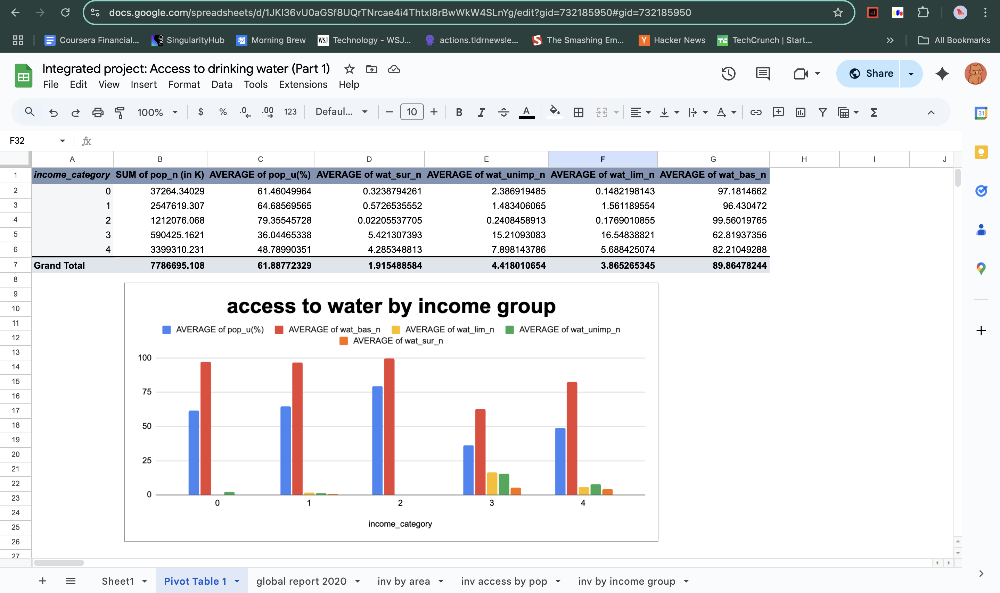
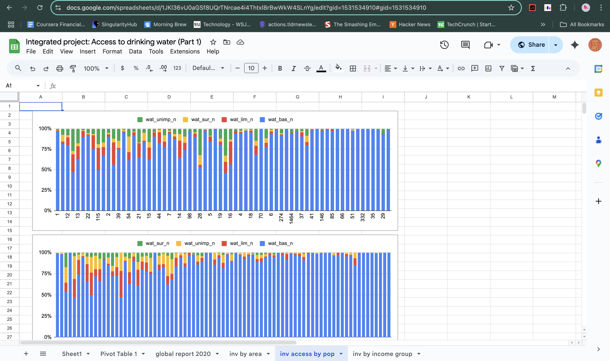

# Access to Drinking Water – Part 1: Understanding the Data (2020)

This project explores access to basic, limited, unimproved, and surface-level drinking water services using 2020 data from the WHO/UNICEF Joint Monitoring Programme (JMP).

>  Completed as part of the ALX Data Analytics Program  
>  Tool: Google Sheets

---

## Objectives

- Clean and structure raw CSV data
- Fix import issues caused by inconsistent separators
- Create new calculated fields (urban population, rural share, etc.)
- Validate and sanitize values (e.g., round percentages > 100%)
- Analyze access levels by area and income group
- Visualize findings using multiple chart types
- Extract key insights from descriptive statistics

---

## Files Included

| File | Description |
|------|-------------|
| `Estimates on the use of water (2020).csv` | Main dataset for 2020 analysis |
| `Integrated project - Access to drinking water (Understanding the data).pdf` | ALX project brief for Part 1 |
| `Screenshots/` | Folder containing visuals (charts, tables, pivot summaries) |
| `README.md` | Project documentation |
| Google Sheets | [🔗 View-only link to the live sheet](https://docs.google.com/spreadsheets/d/1JKl36vU0aGSf8UQrTNrcae4i4Thtxl8rBwWkW4SLnYg/edit?usp=sharing) |

---

## Key Features Created

- `value_cnt`: Row completeness check using `COUNTA()`
- `pop_u_val`: Urban population (derived from % × population)
- `pop_r`: Rural population share
- `pop_n (m)`: Population in millions
- `wat_bas_n (rounded)`: Basic access % cleaned to not exceed 100%
- `pop_u (rounded)`, `pop_r (rounded)`: Cleaned population share values

---

## Visualizations

-  Line chart: National population vs urban/rural population share
-  Box plot: Distribution of water access types nationally
-  100% stacked column charts: Access levels by population share
-  Pivot table: Income group vs access types

---

## Sample Screenshots

| Chart | Description |
|-------|-------------|
|  | Distribution of access types by country |
|  | Water access levels by income group |
|  | 100% stacked bar by population group |
|  | Urban vs rural share comparison |

>  Screenshots folder includes core insights and analytical charts used throughout the project.

---

##  Key Insights

- Rural populations have significantly lower access compared to urban.
- High-income countries dominate in basic access; low-income struggle more with unimproved or surface water access.
- Data inconsistencies (e.g., >100%) require logical correction before analysis.

---

## Skills Demonstrated

- Data cleaning and preparation in spreadsheets
- Formula logic (`COUNTA`, `IF`, `ISNUMBER`, `ROUND`)
- Descriptive statistics (mean, median, IQR)
- Visualization (line, box plot, stacked bar)
- Data interpretation and communication

---
